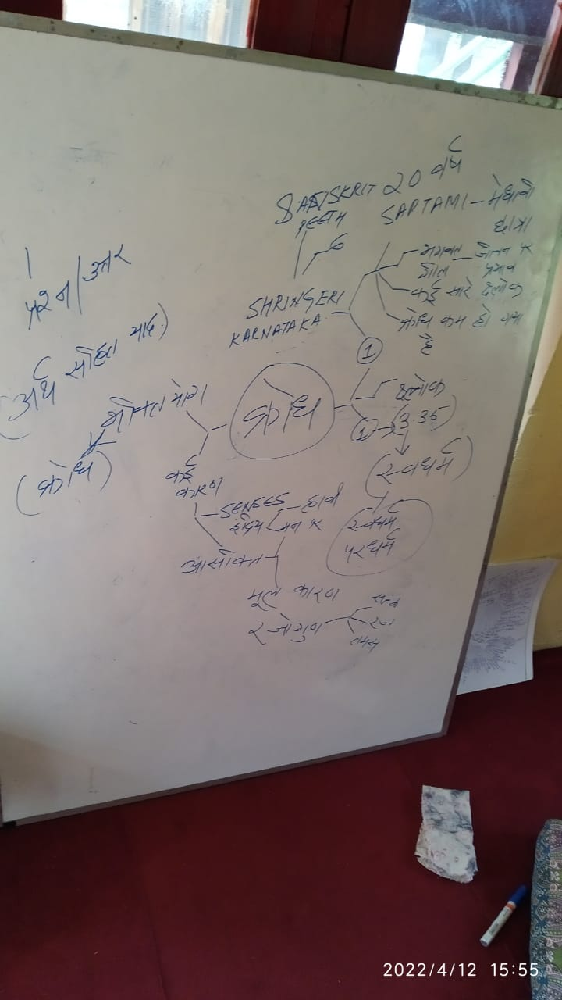
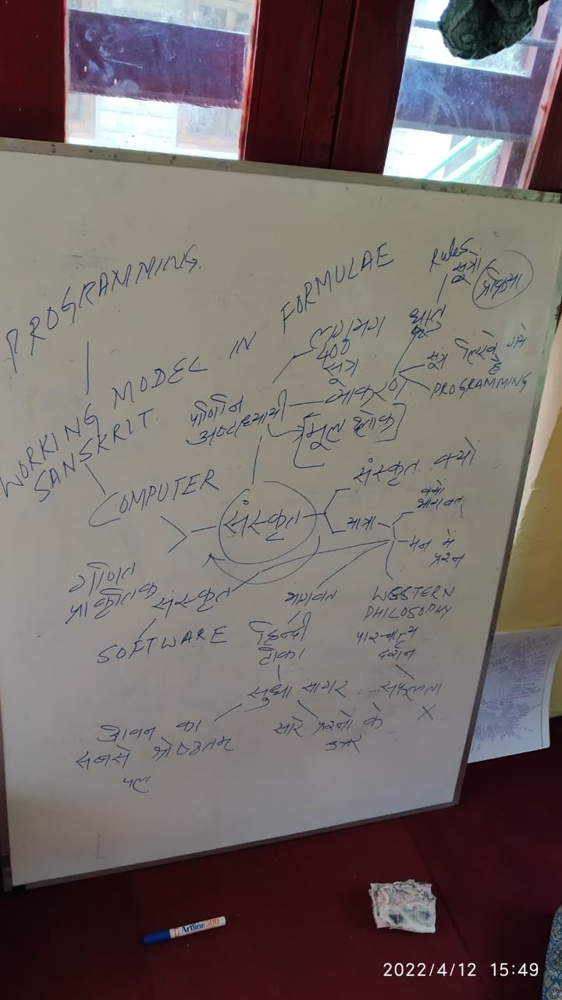
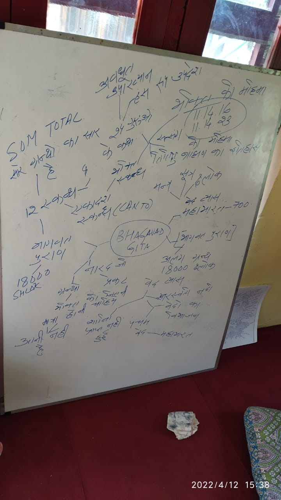
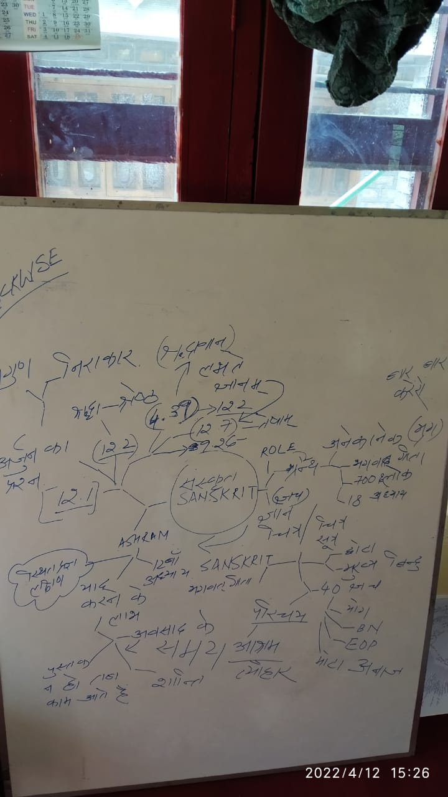
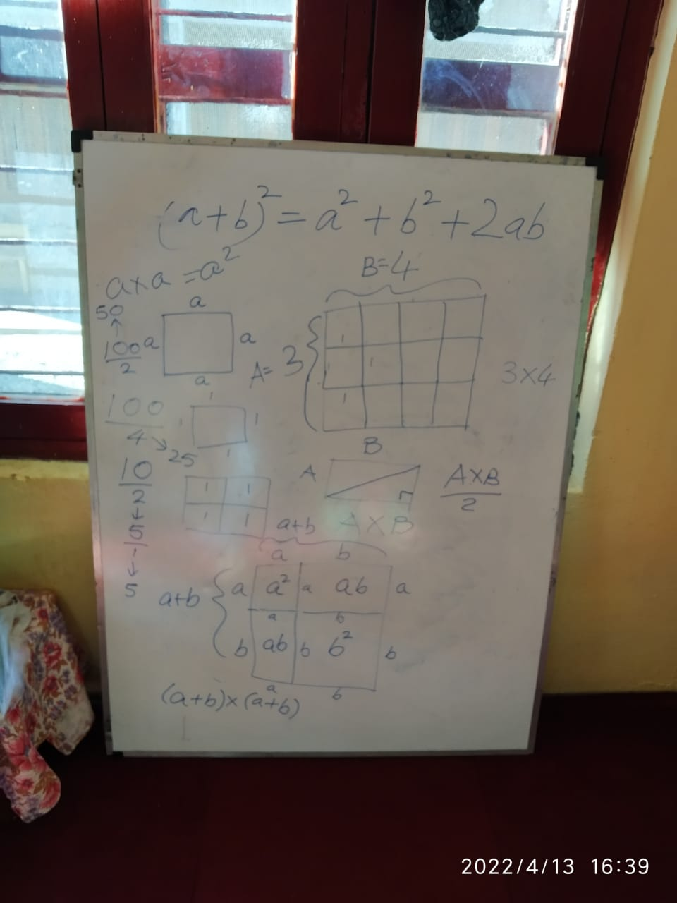

# Lakshmi Ashram Kausani

## Abbreviations

**BG**: Bhagavat Gita

**SB**: Shrimad Bhagavatam

**AP**: Anvaya Padcched

**MM**: Mind Mapping

**NSR**: Natural Solar Routine

**ZBL**: Zero Budget Life

**HLM**: Holistic Life Management

**40YP**: 40 Year Plan

**OVA**: Old Volunteer of Ashram

**EOP**: Economy of Permanence

**FOSS**: Free and Open Source Software

## Activity Log

1. **2022-04-12:** MM Introduction, BG Introduction, SB Introduction, Q/A on life in light of BG and SB. NSR, ZBL introduction in evening. 

2. **2022-04-13:** MM presentation, Sanskrit exhibition discussion with visitors. Bhagavat Gita exchange with OVA. Live MM workshop on Introspection, life, inspiration from elders in ashram and questions to be answered. Hands-on Mathematics workshop covering basic concepts in Algebra, Fractions and Mensuration. Individual interaction on ZBL, impact of NSR on Women with respect to Menstrual Cycle. 

3. **2022-04-14:** Yoga (standing asanas), HLM (life story) with an OVA, Sangeet Kaksha on BG in light of Ghantasala BG Gayan. Introduction to 40YP. Social Research Method BA Second Year. Naturopathy Aphorisms. SB stories. Apiary. 

4. **2022-04-15:** Morning mountain walk with children. BG 2.22, 2.23 AP session. Holistic Session on BG, Education, Sanskrit Grammar etc with OVA. Evening mountain walk with an OVA. 

5. **2022-04-16:** Solution at level of Philosophy, Consciousness and Brain, State of Being - Session with OVA. EOP MM Factorisation Part-2. Learning how to send an e-mail. Gainthi (Air Potato) seed, Giloy, Pahadi Raw Haldi for sowing. MM discussion with an OVA. She liked Mango Channa pickle recipe. FOSS Movement Discussion with her. Real Education and inspiration to take Physics - Session with another OVA (our usual friend). EOP & 40YP session with Chair Person OVA. Watering in Garden. 

## Activities in Pipeline

1. Seeds' naming
2. Personal subject wise workshops
3. MM workshop for child with health problem
4. Knoppix
5. BG Chapter 12 MM 
6. Ekadash Skandh MM -> 24 Gurus MM
7. Ashram inspirational books' MM 
8. NSR MM 
9. Yoga pending asanas 
10. Flute making
11. Ekadash Vrat MM 
12. Apiary 

